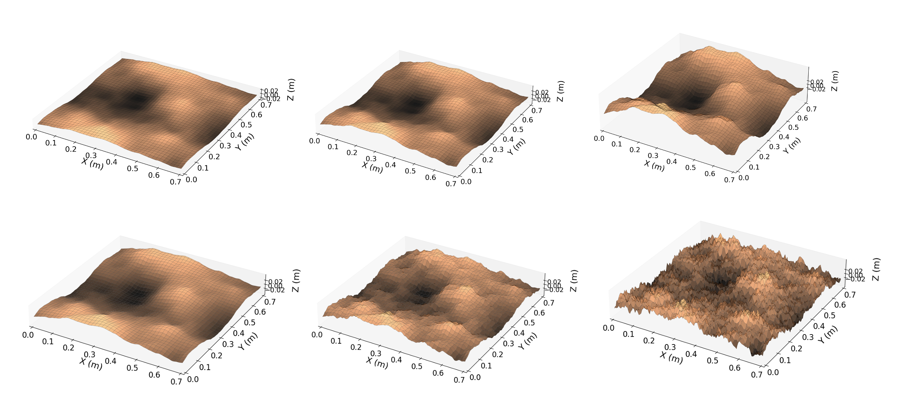

# fractal_terrain

A repository for generating virtual terrain using concepts of fractal geometry



## How to use

## Generate terrain point cloud (save to csv and create mesh file)

```bash
ros2 launch fractal_terrain fractal_terrain.launch.py
```

## Save and display the image

```bash
python3 virtual_fractal_terrain.py
```